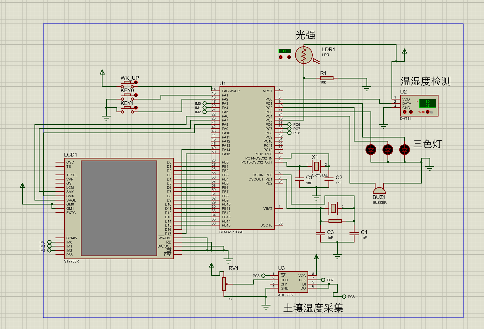
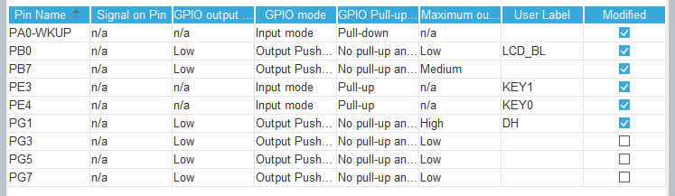
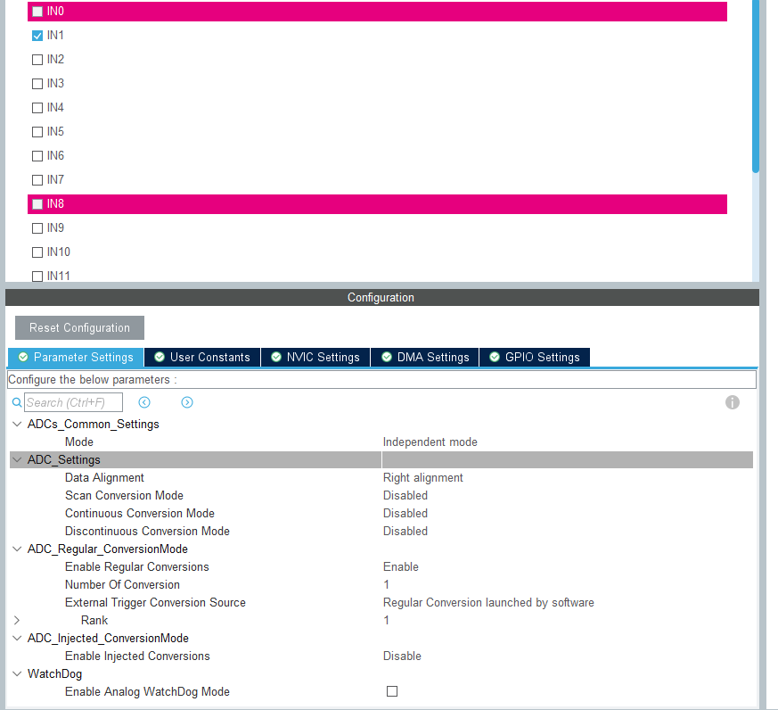
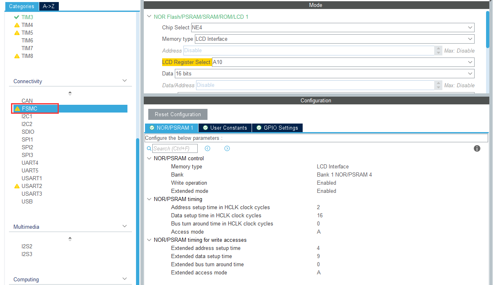
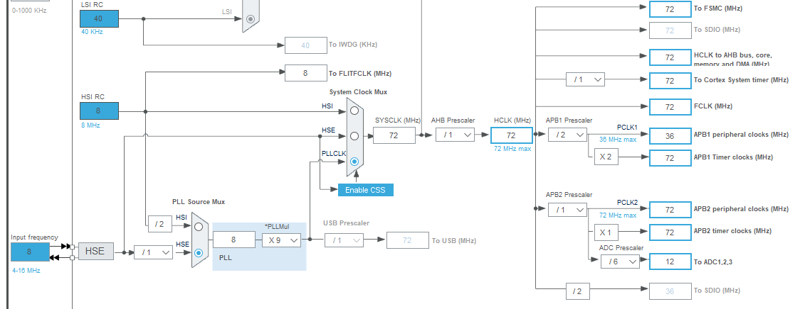
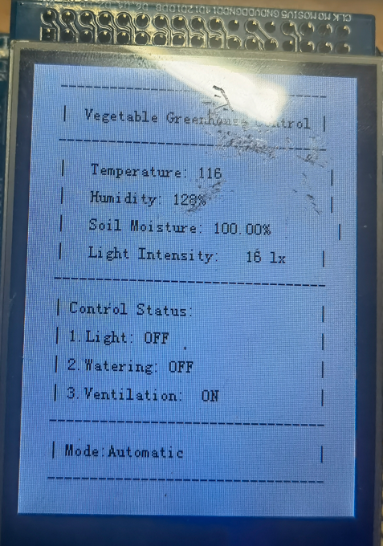
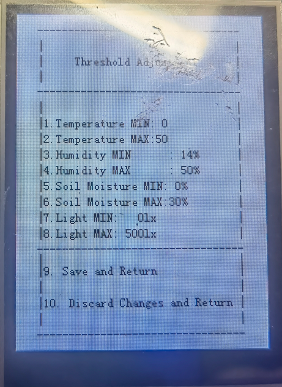

# 基于STM32的温室控制系统

> 使用正点原子精英板（STM32F103ZET6） 
> 使用HAL库开发 
> 引脚配置使用CubeMX，代码编写使用keil5  
> 由于写这个README的时候，距离这个项目完成已经半年多了，所以其中内容难免有错误，对此造成的困难我感到非常抱歉

## 基础功能

1. 监测功能：监测温室的当前状态，包括空气温度、空气湿度、光照度、土壤湿度、等参数等的信息采集以及各个设备的开关状态。
2. 设定功能：可以设定各个温室的运行参数，温室内的土壤湿度、时间等参数来自动控制水泵等的目标值，通过空气温度、空气湿度、光照、等参数来自动控制风机、延长光照设备等的目标值和设备的开启/关闭等等。
3. 手动控制：可以实现强制手动控制温室内的设备的开关状态。

## 使用

使用FlyMcu软件将`\intelligent_control\MDK-ARM\intelligent_control\intelligent_control.hex`烧录即可

## 使用的元器件

1. TFT-LCD，薄膜晶体管液晶显示器--用于显示各种参数
2. 土壤湿度检测器--用于检测土壤的湿度
3. 三色灯--用于表示补光装置,水泵、风机设备是否在工作
4. 温湿度检测器--用检测空气温度/湿度
5. 光照强度检测--用于检测光照强度
6. 蜂鸣器--用于报警

## 部分缺陷

- 由于完成这个作业时元器件有限，所以只是使用一个三色灯来表示补光装置,水泵、风机三个设备的工作状态，并未使用这三个设备
- 电路图中由于部分元器件未找到，所以电路图并不全面

## 电路图

## 配置

### GPIO配置

- `PA0-WKUP`引脚按钮`KEY_UP`，用于界面的切换
- `PB0`引脚为LCD屏幕背光引脚
- `PE4`为按钮`KEY0`，用于进入修改视图和切换选项
- `PE3`为按钮`KEY1`，用于在查看视图下改变模式和在修改视图下改变状态和阈值大小
- `PB7`引脚用于控制蜂鸣器报警
- `PG1`引脚接入`DHT11`温湿度传感器的`data`引脚
- `PG3、5、7`引脚接入三色灯的三个引脚，用于反映当前对相应报警的处理

### ADC配置

#### ADC1

ADC1使用下面配置，引脚为`PA1`

开启ADC中断

### 定时器

### LCD屏幕

### 时钟树

## 详细功能介绍

> 由于在写这个文章时距离这个项目完成已经很久了，所以我在演示时并没有连接传感器，因此下面图中显示的数据并不正确

#### 主界面

1. 传感器数据

   - Temperature：温度

   - Humidity：湿度

   - Soil Moisture：土壤湿度

   - Light Intensity：光照强度

2. 装置控制

   - Light：补光装置

   - Watering：水泵

   - Ventialtion：风机

3. 模式选择（Mode）：可在主界面按下`KEY1`切换

   - Automatic：自动模式
     - 当发生传感器数据超过阈值时，蜂鸣器会进行报警处理，上面的装置也会根据错误类型进行相应处理

   - Manual：手动模式
     - 可以手动开关三个装置，并关闭报警系统

#### 阈值修改界面

可以在主界面中按下`KEY_UP`切换

1. 使用

   - 按下`KEY0`进入修改视图，可以看到在标号出有闪烁的黄色方块，继续按下可以切换选项

   - 在修改视图下，按下`KEY1`可以修改相应阈值，长按可持续增长阈值大小

2. 内容含义

   - Temperature MIN/MAX：温度最低/最高阈值，最高阈值上限在60，超过60会重新重MIN值处开始。

   - Humidity MIN/MAX：湿度

   - Soil Moisture MIN/MAX：土壤湿度

   - Light MIN/MAX：光照强度

   - 选项9：保存并退出修改视图

   - 选项10：不保存并退出
